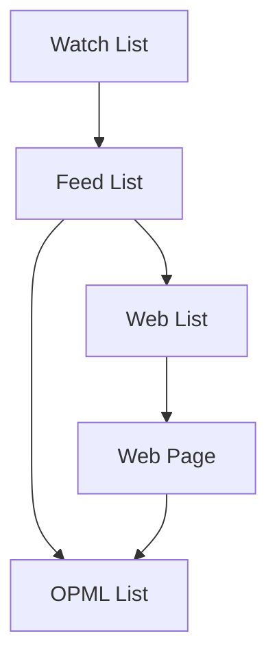

# @jser/watch-list

A collection of items that are explained in [JSer.info][].

You can found JavaScript resources from JSer.info [Dataset](https://github.com/jser/dataset).

<http://jser.info/watch-list> will be updated every day at 00:00.

## Usage

1. Visit <http://jser.info/watch-list>
2. Found interesting JavaScript resource!

## Building



- Watch List: 2年間のJSer.infoの記事を集計したもの
- Feed List: Watch Listに対応するRSSフィード
- OPML List: 流量を調整したOPML
- Web List: ウェブサイト用

### Watch List

JSer.infoの記事を集計して、ウェブサイトのリストを生成する。

1. Collect items in 2-years
2. Count by item's domain and sort it
3. Save to `data/watch-list.json`
- FILTER: 
  - 汎用サイトは除外

### Feed List

Watch Listから、各サイトのRSSフィードを取得してマッピングしたリストを生成する。

1. Generate Watch List
2. Visit each item's page and get RSS feeds
3. Save RSS feeds to `data/feed-list.json` and `data/feed-list.opml`

📝 `data/feed-list.json` を直接編集することで、RSSフィードを手動でも変更できる。
更新時は一度入ったフィードはずっと残るので、変更は手動で対応する必要がある。

### OPML List

Feed Listから、流量を調整したOPMLファイルを生成する。

1. Generate OPML data from `data/feed-list.json`
2. Save OPML file to `data/opml-list.opml`
3. Save OPML as JSON to `data/opml-list.json`
- FILTER: 
  - 購読向きのサイトのみに絞る 
  - 汎用ニュースは除外
  - 流量が多いサイトは除外
  - フォーラムは除外
  - 重複しているサイトは除外

### Web List

<https://jser.info/watch-list/> で利用するウェブサイト用のリストを生成する。

1. Generate Watch List and Feed List
2. Merge Watch List and RSS Feeds to `data/web-list.json`

## Development

Update Data:

```
npm run update-data
```

Run following command:

```
npm run dev
```

## Contributing

Pull requests and stars are always welcome.

For bugs and feature requests, [please create an issue](https://github.com/jser/watch-list/issues).

1. Fork it!
2. Create your feature branch: `git checkout -b my-new-feature`
3. Commit your changes: `git commit -am 'Add some feature'`
4. Push to the branch: `git push origin my-new-feature`
5. Submit a pull request :D

## Author

- azu: [GitHub](https://github.com/azu), [Twitter](https://twitter.com/azu_re)

## License

MIT © azu

[JSer.info]: https://jser.info
